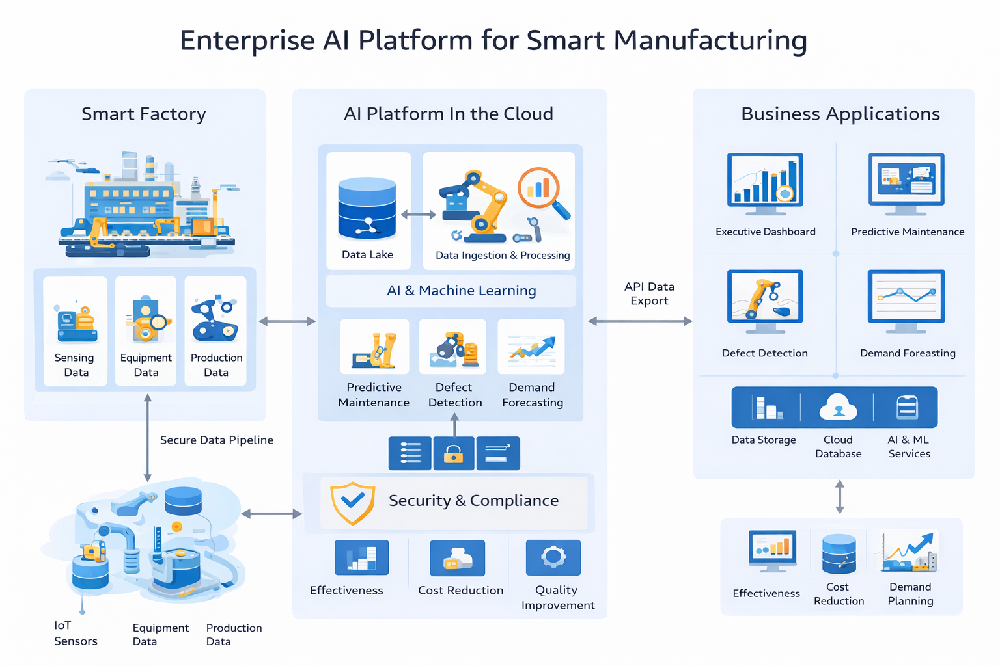
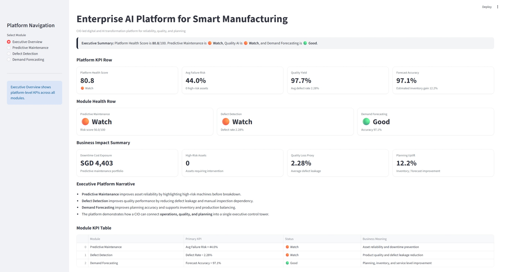
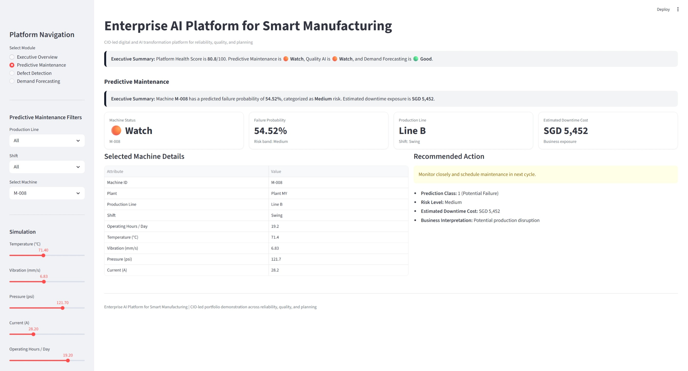
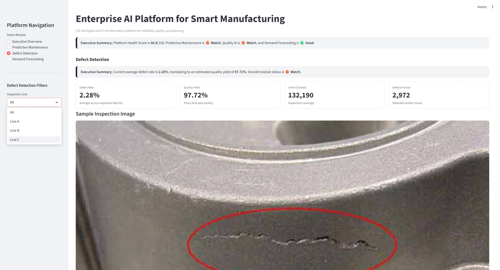
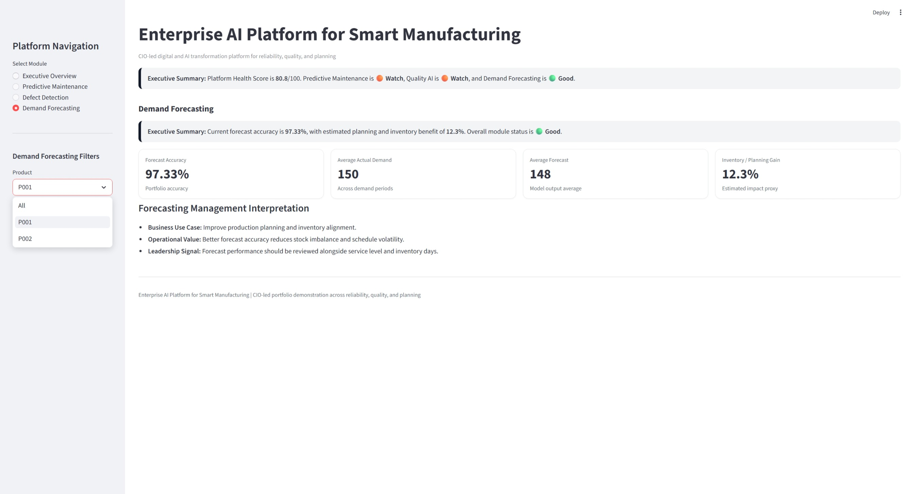

# Enterprise AI Platform for Smart Manufacturing

## CIO-Led Digital & AI Transformation Platform

This project showcases a CIO-led Enterprise AI Platform designed to transform traditional manufacturing into a data-driven, intelligent, and predictive operation.

It integrates three business-focused AI capabilities into a unified executive control tower:

- **Predictive Maintenance** for asset reliability and downtime prevention
- **Defect Detection** for quality improvement and inspection effectiveness
- **Demand Forecasting** for better planning, inventory alignment, and decision support

---

## Business Objective

Manufacturing organizations often face:

- Unplanned machine downtime
- Inconsistent product quality
- Poor demand visibility
- Siloed operational data across systems such as MES, ERP, and IoT

This platform addresses these challenges by combining operational data, AI-driven insights, and executive-level visualization into one decision-support layer.

---

## Platform Modules

### 1. Predictive Maintenance
This module estimates machine failure probability using operating conditions such as temperature, vibration, pressure, current, and operating hours.

**Business value**
- Reduce unplanned downtime
- Prioritize maintenance interventions
- Improve equipment reliability
- Support proactive asset management

### 2. Defect Detection
This module represents AI-supported quality inspection to detect defects earlier and reduce quality leakage.

**Business value**
- Improve first-pass yield
- Reduce manual inspection dependency
- Lower defect escape risk
- Strengthen quality visibility by production line

### 3. Demand Forecasting
This module compares actual demand and forecast demand to show forecasting accuracy and planning impact.

**Business value**
- Improve production planning
- Reduce inventory imbalance
- Support supply chain alignment
- Increase forecast confidence for leadership decisions

---
## Executive Dashboard Capabilities

The Streamlit dashboard provides:

- **Executive Overview** with platform KPI row, module health, and business impact summary
- **Predictive Maintenance** view with machine-level risk simulation
- **Defect Detection** view with quality KPIs and inspection trends
- **Demand Forecasting** view with forecast accuracy and demand comparison

---

## KPI Areas Covered

- Platform Health Score
- Failure Risk
- High-Risk Assets
- Downtime Cost Exposure
- Defect Rate
- Quality Yield
- Forecast Accuracy
- Planning / Inventory Uplift

---

## Technology Stack

- **Python**
- **Streamlit**
- **Pandas**
- **NumPy**
- **Plotly**

---

## How to Run

Install dependencies:

''' bash
- pip install streamlit pandas numpy plotly
- python -m streamlit run app.py

---

## Repository Structure

- 01-Predictive-Maintenance
- 02-Defect-Detection
- 03-Demand-Forecasting
- 04-Executive Deck
- 05-Architecture-Diagrams
- 06-Screenshots
- images
- app.py
- Portfolio_Case_Study.md
- README.md

---

## CIO Perspective

This is not just a technical demo. It is positioned as a leadership-oriented AI platform showing how a CIO can connect:

- Operational resilience
- Product quality
- Demand planning
- Executive visibility
- Business value realization

The project demonstrates how AI can be embedded into enterprise transformation, rather than treated as isolated experimentation.###

---

### Author Positioning

Vincent Eng
Enterprise CIO | Head of IT | Digital & AI Transformation | Data Strategy | Smart Manufacturing

This repository is part of a broader portfolio focused on CIO-level digital transformation, enterprise architecture, and applied AI for business value.

---

## 🏗️ Enterprise Architecture Overview

This platform demonstrates a CIO-level enterprise architecture integrating smart manufacturing operations with AI-driven decision-making.

- End-to-end data flow from factory floor to executive insights
- Unified AI platform supporting multiple use cases
- Secure, scalable, and cloud-ready design
- Direct alignment with business outcomes (cost, quality, efficiency)

---

## Screenshots

 

 

02-Projects/Enterprise-AI-Platform-for-Smart-Manufacturing/
